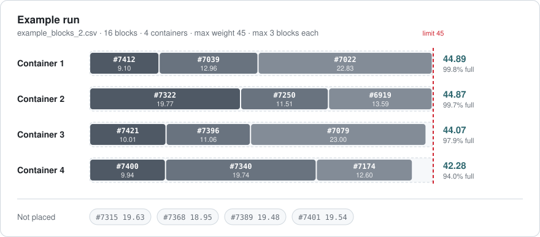
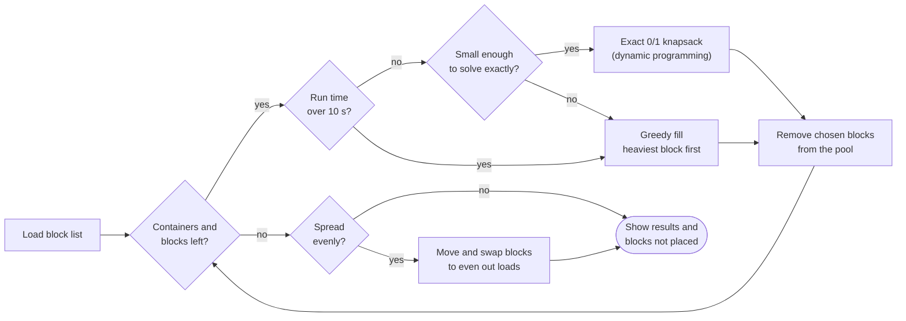

# Granite Block Allocator

**A desktop tool that works out how to load granite blocks into shipping containers so each one carries as much weight as possible without going over its limit. Give it a block list from Excel or a CSV file, say how many containers you have and how much each can carry, and it tells you which blocks go where.**

[](https://github.com/AtlasICL/granite_block_allocator/releases/latest)


[](https://github.com/AtlasICL/granite_block_allocator/actions/workflows/test.yml)

<picture>
  <source media="(prefers-color-scheme: dark)" srcset="docs/images/example-allocation-dark.svg">
  
</picture>

<sub><i>A real run on <a href="test/resources/example_blocks_2.csv"><code>example_blocks_2.csv</code></a>: 16 blocks, 4 containers, a limit of 45 and at most 3 blocks per container. The first three containers come within 1 unit of the limit.</i></sub>

---

## Overview

> [!NOTE]
> **In production.** The allocator is actively used by a client who ships granite blocks, to plan how their containers are loaded.

It is a small Tkinter app distributed as a single Windows executable. The allocation logic, file reading and exports are kept separate from the interface, so they can be tested on their own.

| | |
|---|---|
| **Input** | A block list as `.xlsx` or CSV, with a block number and a weight column. Header spelling, separators and decimal commas are handled for you. |
| **Settings** | Number of containers, max weight per container, optional max blocks per container, and an option to spread the load evenly |
| **Output** | Each container's blocks, total and fill level, plus the blocks that didn't fit |
| **Exports** | Copy to the clipboard (pastes into Excel), save as CSV, or print a loading sheet with tick boxes |
| **Method** | Exact 0/1 knapsack by dynamic programming, one container at a time, to 0.01 of a weight unit |
| **Safety nets** | Greedy fallback for very large inputs and a 10-second time limit, with a note in the results whenever either is used |
| **Distribution** | One-file Windows executable, built and published by GitHub Actions for each version tag |
| **Quality** | 121 unit tests on Ubuntu and Windows, plus `ruff` linting and `mypy` type-checking in CI |

<p align="center">
  <a href="#using-the-app">Using the app</a> ·
  <a href="#preparing-the-block-list">Block list format</a> ·
  <a href="#how-the-allocation-works">How it works</a> ·
  <a href="#running-from-source">Running from source</a> ·
  <a href="#development">Development</a> ·
  <a href="#releasing">Releasing</a> ·
  <a href="#project-structure">Structure</a>
</p>

---

## Using the app

1. Download `GraniteBlockAllocator.exe` from the [**latest release**](https://github.com/AtlasICL/granite_block_allocator/releases/latest) and run it.
2. Click **Browse…** and choose your block list (`.xlsx` or `.csv`).
3. Fill in the settings:

   | Setting | What it means |
   |---|---|
   | **Number of containers** | How many containers you have available. |
   | **Max weight per container** | The most each container can carry, in the same unit as your `Weight` column. `27.5` and `27,5` both work. |
   | **Max blocks per container** | Optional cap on how many blocks go in one container (1–10), or *No limit*. |
   | **Spread the load evenly** | Off by default. When ticked, the weight is evened out across the containers instead of filling each one to the limit in turn. Every block that would have been shipped still is. |

4. Click **Run allocation** or press <kbd>Enter</kbd>. The app stays responsive while it works and shows progress.

The results window opens with a summary at the top (blocks placed, weight loaded, how much of the capacity is used), then a card for each container listing its blocks and their weights, with the total and a fill bar. Any blocks that didn't fit are listed in a **Not placed** card at the end. Running again replaces the previous results.

| Button | What it does |
|---|---|
| **Copy** | Copies the allocation as tab-separated text, which pastes into Excel as columns (also <kbd>Ctrl</kbd>+<kbd>C</kbd>). |
| **Save as CSV…** | Saves one row per block: container, block number, weight, container total. Blocks that didn't fit are listed as *Not placed*. |
| **Print loading sheet…** | Opens a printable sheet in your browser, with one table per container and a tick box per block for the loading crew. |

> [!TIP]
> The app remembers your last block list and settings between runs, so for a regular shipment you only need to press **Run allocation**. They're saved in `%APPDATA%\Granite Block Allocator\settings.json` on Windows, `~/Library/Application Support/Granite Block Allocator/` on macOS, and `~/.config/Granite Block Allocator/` on Linux.

## Preparing the block list

The first non-blank row must be a header row containing these two columns. Any other columns, such as dimensions, volume or notes, are ignored and can be in any order.

| Column | Also recognised as | Description |
|---|---|---|
| `BlockNo` | `Block No`, `Block Number`, `Block ID`, `block_no`… | The block's identifier, kept exactly as written, so `0612` and `A-17` stay as they are. |
| `Weight` | `WEIGHT`, `Wt`, `Weight (t)`, `Weight [kg]`… | The block's weight, in the same unit as *Max weight per container*. Must be more than 0. |

Matching ignores capitals, spaces, underscores, hyphens and a unit in brackets at the end of the name. If two columns could both be the weight (for example `Weight` and `Weight (kg)`), the app asks you to rename one rather than guessing.

```csv
BlockNo,L,H,W,Volume,Weight
6017,245,135,110,3.64,13.1
6131,185,160,140,4.14,15.1
6209,220,180,105,4.16,16.7
6307,190,85,150,2.42,10.6
```

<details>
<summary><b>What the app copes with, and what it rejects</b></summary>

<br>

| Handled automatically | |
|---|---|
| **Excel workbooks** | `.xlsx` and `.xlsm` files are read directly, from the sheet that was open when the file was last saved. |
| **European CSV exports** | Files separated with `;` or tabs, and weights written with a decimal comma (`13,1`). See [`excel_semicolon_export.csv`](test/resources/excel_semicolon_export.csv). |
| **Encodings** | UTF-8 (with or without a byte-order mark) and the Windows code page that Excel uses for "CSV (Comma delimited)". |
| **Blank rows** | Empty rows, including the `;;;` rows Excel often adds at the end, are skipped. |
| **Untidy headers** | See [`messy_headers.csv`](test/resources/messy_headers.csv). |

| Rejected, with a message saying where | |
|---|---|
| A missing `BlockNo` or `Weight` column | The message lists the columns the file does have. |
| An empty block number or weight | Reported by row number, matching the row numbers in Excel. |
| A weight that isn't a number, or is 0 or less | For example `Row 5 (block 6307): 'n/a' is not a number`. |
| Old `.xls` workbooks | The message explains how to save as `.xlsx` or CSV. |

If the same block number appears more than once, the app warns you and lets you choose whether to continue.

</details>

---

## How the allocation works

Containers are filled **one at a time**. For container 1 the program picks the combination of blocks whose total weight comes as close as possible to the limit without going over, while respecting the max-blocks setting. Those blocks are removed from the pool, container 2 is filled from what is left, and so on.



| | Behaviour |
|---|---|
| **Exact where it can be** | Each container's selection is found with an exact optimisation (a 0/1 knapsack solved by dynamic programming), working to 0.01 of a weight unit. |
| **Fallback for very large jobs** | If the input is too large to solve exactly in reasonable time, the program adds the heaviest blocks first instead. This is usually close to the best result but isn't guaranteed, so the results window says when it happened. |
| **10-second time limit** | If the run passes 10 seconds, the remaining containers are filled with the greedy method from the whole remaining pool, so the app never hangs. |
| **Leftover blocks** | Blocks that don't fit into any container, including any block heavier than the limit, are listed under *Not placed*. |
| **Fewer containers than requested** | Once every block is placed, or nothing left fits, the run stops and only the containers used are shown, with a note explaining why. |
| **Spread the load evenly** | Filling one container at a time makes each container as full as possible in turn, so later containers can end up lighter, as container 4 does in the example above. With this option, the shipped blocks are rearranged across all the requested containers to even out their weights. On the example above, this narrows the gap between the heaviest and lightest container from 2.61 to 1.16. |

<details>
<summary><b>Algorithm details</b></summary>

<br>

All of this lives in [`allocator/logic.py`](allocator/logic.py).

- **Integer weights.** Weights and the capacity are multiplied by 100 and rounded, so the knapsack runs on integers. This is where the 0.01 precision comes from.
- **Standard knapsack.** With no block limit, `dp[j]` holds the heaviest load that fits in capacity `j`. Each block is processed once with NumPy vector operations, and a boolean `chosen` table is kept so the selected blocks can be recovered by walking backwards from full capacity.
- **Block-count limit.** When *Max blocks per container* is set (and is smaller than the number of blocks), the table gains a second dimension: `dp[k, j]` is the heaviest load using at most `k` blocks in capacity `j`. The best `k` is picked at the end.
- **When it switches to greedy.** Before solving, the program estimates the size of the table as
  `blocks × (capacity × 100 + 1) × (max_blocks + 1)`, leaving out the last factor when there is no block limit.
  Above 50 million cells it uses the greedy method instead. For example, 200 blocks with a limit of 28 and a 3-block cap is about 2.2 million cells, so it is solved exactly.
- **Greedy method.** Blocks are sorted heaviest first, and each is added if it still fits under both the weight and block limits.
- **Top-up pass.** After filling, any leftover block that still fits somewhere is added. This can only help after a greedy fill, since the exact method would already have taken it.
- **Balancing.** Runs after the containers are filled, using all the requested containers. Each step looks at every pair of containers and makes the single move, or swap of two blocks, that most reduces the sum of the squared container loads, staying within both limits. The pass stops when no move helps. Because every step strictly reduces that sum, the pass always ends. Balancing never removes a block, and a final top-up adds any leftover block that now fits.

</details>

---

## Running from source

Requires **Python 3.12 or newer** with Tkinter. Tkinter comes with the standard python.org installers for Windows and macOS. On some Linux distributions it is a separate package, for example `python3-tk`.

```bash
git clone https://github.com/AtlasICL/granite_block_allocator.git
cd granite_block_allocator
just setup
just run
```

`just setup` creates `./venv` and installs the dependencies, which are pinned to exact versions in `requirements.txt` (runtime) and `requirements-dev.txt` (build and tooling).

## Development

To run the tests, run `just test`. Extra arguments are passed to `unittest`, so `just test -k Balancing` runs only the matching tests. To lint, run `just lint`; to format, `just fmt`; and to type-check, `just typecheck`. `just check` runs all of them, the same as CI. Run `just` on its own to list everything else in the [`justfile`](justfile).

CI ([`test.yml`](.github/workflows/test.yml)) runs the tests on Ubuntu and Windows, plus the lint, format and type checks, for every push and pull request to `master`.

| Test file | Tests | Covers |
|---|:-:|---|
| [`test_blockfile.py`](test/test_blockfile.py) | 36 | Column matching and its error messages, block numbers kept as text, blank rows, `;` and tab separators, decimal commas, Windows encodings, row-numbered errors, Excel workbooks, duplicate detection |
| [`test_logic.py`](test/test_logic.py) | 68 | Knapsack optimality and limits, greedy fallback, the time limit using the whole pool, leftover reporting, file order of blocks, balancing (moves, swaps, limits, same blocks shipped), end-to-end runs on the sample files |
| [`test_export.py`](test/test_export.py) | 8 | CSV rows and byte-order mark, clipboard text, summary lines, the loading sheet's contents and HTML escaping |
| [`test_settings.py`](test/test_settings.py) | 9 | Parsing what's typed into the form, saving and loading settings, corrupt or missing settings files, settings location on each OS |

Sample block lists, including edge cases such as empty files, missing columns, blank values and real-world export formats, are in [`test/resources/`](test/resources/).

## Releasing

To release, set the version with `just bump 0.3.0`, commit it, then run `just release 0.3.0`. This tags `v0.3.0` and pushes the tag, after asking for confirmation and checking that the version matches and nothing is uncommitted. The [release workflow](.github/workflows/release.yml) then runs the tests, builds `GraniteBlockAllocator.exe` on Windows and attaches it to a GitHub release.

To build the executable yourself, run `just compile`. PyInstaller builds for the operating system it runs on, so run it on Windows to get the `.exe`.

## Project structure

```
granite_block_allocator/
├── main.py                 # Entry point: high-DPI setup, launches the GUI
├── allocator/
│   ├── __init__.py         # App name and version (single source of truth)
│   ├── blockfile.py        # Reading CSV and Excel block lists
│   ├── logic.py            # Allocation algorithms and the result object
│   ├── export.py           # CSV, clipboard and printable loading sheet
│   ├── settings.py         # Form parsing and remembered settings
│   └── gui.py              # Tkinter interface (settings and results windows)
├── assets/                 # App icon (.ico for the executable, .png for the window)
├── test/
│   ├── test_*.py           # Unit tests
│   └── resources/          # Sample block lists used by the tests
├── docs/images/            # Images used in this README
├── requirements.txt        # Pinned runtime dependencies
├── requirements-dev.txt    # Pinned build and tooling dependencies
├── pyproject.toml          # ruff and mypy configuration
├── justfile                # Common commands (just test, just lint, …)
└── .github/workflows/
    ├── test.yml            # Tests, lint and type-check on every push
    └── release.yml         # Builds and publishes the .exe for version tags
```

## License

Released under the [MIT License](LICENSE).

---

<div align="center">
<sub>Built by <a href="https://github.com/AtlasICL">Atlas Acarsoy</a> · 2025–2026</sub>
</div>
